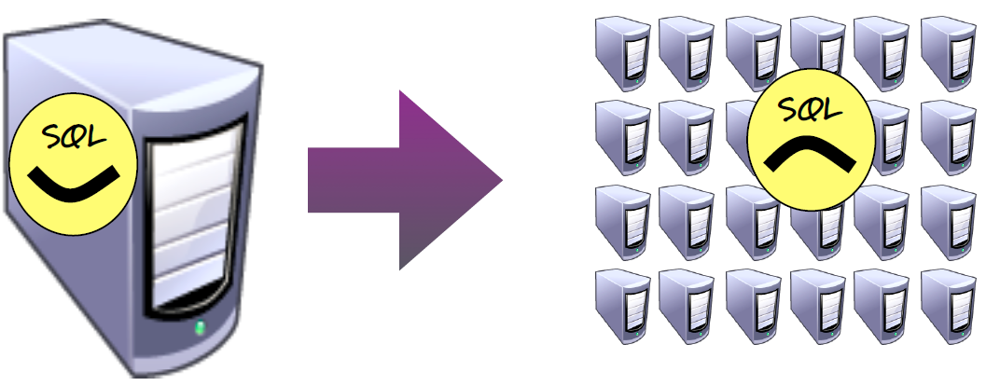
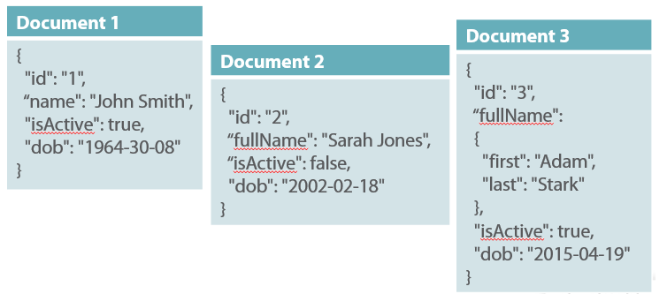

# Giới thiệu về NoSQL

**_NoSQL_**, được viết tắt bởi **_"Not Only SQL"_** là phương pháp thiết kế Database thay thế cho Cơ Sở Dữ liệu truyền thống (**_RDBMS_**). 

Với các hệ thống cơ sở dữ liệu truyền thống ( _RDBMS_ ), hệ thống các bảng, các mối quan hệ, cấu trúc dữ liệu thường được thiết kế cẩn thận trước khi triển khai, điều này cũng có nghĩa rằng việc thay đổi cấu trúc dữ liệu sẽ trở bên khó khăn và hiếm khi xảy ra trong các phiên bản phần mềm. 
Ngày nay, với nhu cầu sử dụng dữ liệu lớn, các hệ thống cơ sở dữ liệu truyền thống, thường được thiết kế để chạy trên một server mạnh, thường gặp khó khăn trong việc nâng cấp, mở rộng (large scale-out) với chi phí đắt đỏ. 

_NoSQL_ là giải pháp hữu dụng cho các vấn đề mà cơ sở dữ liệu truyền thống gặp phải với các đặc tính phổ biến:

- Không sử dụng mô hình quan hệ (rational model)
- Thường là Open Source
- Không xác định rõ cấu trúc dữ liệu (Schemaless)
- Hoạt động tốt với mô hình Clusters, dễ mở rộng (large scale-out)

Các các hệ thống cơ sở dữ liệu _NoSQL_ thường được chia thành 4 loại căn cứ vào mô hình thiết kế của chúng:

- Key-Value Stores
- Document Stores
- Column Family Databases
- Graph Databases

## Key-Value Stores

Kiểu NoSQL này sử dụng hash-table để lưu các unique-key trỏ đến các value tương ứng. Value có thể là bất cứ dạng dữ liệu nào: giá trị dạng number, text, JSON, BSON... 

Đây là dạng thiết kế đơn giản nhất của NoSQL. Client có thể sử dụng 3 method cơ bản: GET, PUT, DELETE để ghi và đọc dữ liệu. Và vì Key-Value NoSQL luôn truy cập Primary Key, nên rất dễ mở rộng vào có hiệu suất cao.

Key-Value Stores là giải pháp cho những ứng dụng yêu cầu tốc độ đọc ghi nhanh:
- Quản lý Session
- Data Caching 

Tuy nhiên, Key-value không phù hợp với các hệ thống đòi hỏi truy vẫn phức tạp. Điển hình của mô hình Key-Value chính là [Redis Cache](https://redis.io/ "Redis").

## Document Stores

Document Stores cũng gần giống Key-Value Stores, với mô hình quản lý theo Key trỏ đến Value tương ứng. Điểm khác biệt là Document Stores lưu trữ dữ liệu có cấu trúc dạng JSON, BSON hoặc XML, được gọi là *document*. Mỗi Document  là một đối tượng có cấu trúc mà thành phần (_attributes_) là dạng string, date, binary hoặc là array. Điều này giúp document dễ dàng được index và truy vấn thông qua các _attributes_.

_Document_ có cấu trúc mềm dẻo, dễ thay đổi theo thời gian, mỗi _documents_ có thể có cấu trúc khác nhau. Các _documents_ có thể được nhóm lại trong các _containers_ tùy thuộc vào yêu cầu bài toán. Mặt khác, các _documents_ còn có thể được chứa ngay trong một _document_ với cấu trúc không cần phải được xác định.

Với sự mềm dẻo trong cấu trúc dữ liệu, và khả năng làm việc trên Cluster với lượng dữ liệu lớn, dễ scale-out, Document Stores thường được sử dụng trong các bài toán:

- Content Management System 
- E-commerce system 

Các cơ sở dữ liệu dạng Document: MongoDB, Couchbase.

## Column Family Databases

Column Family database lưu trữ dữ liệu tại cells of columns 

## Graph Databases

d

## Reference 

[NoSQL (Not Only SQL database)](https://searchdatamanagement.techtarget.com/definition/NoSQL-Not-Only-SQL "NoSQL (Not Only SQL database)")

[NoSQL Data Architecture & Data Governance: Everything You Need to Know](http://www.dataversity.net/nosql-data-architecture-data-governance-everything-need-know/ "NoSQL Data Architecture & Data Governance: Everything You Need to Know")

[What is a Column Store Database?](https://database.guide/what-is-a-column-store-database/)

