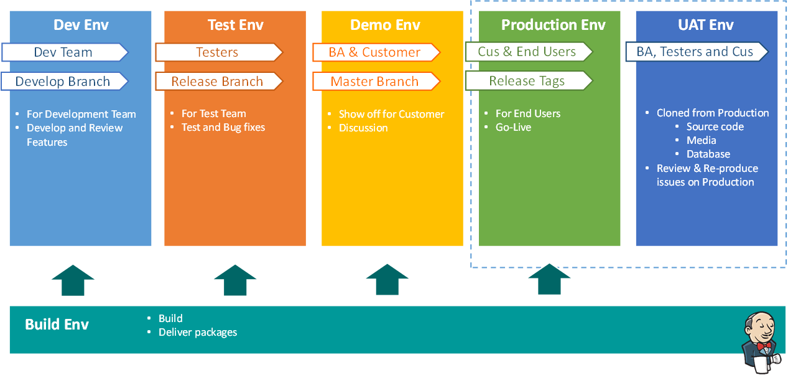

# Software Engineering Process

## Environments

### Development Environment

Features will be develop in the `Local Environment` (_Developer's workspace_), under _Features Branches_.
After that, the Features will be merged into _Develop Branch_.

At this time, the new updates should be built into `Development Environment`. This is the place that whole team could see what features would be done already, need to update or not, and ready for release in next version.

`Development Environment` should be built automatically at right time something is pushed in to _Develop Branch_.

### Test Environment

`Test Environment` is the place that Tester is working on. It could be built from _Develop Branch_ or _Release Branch_, depend on the statergy of the project.
`Test Environment` is build or update under PM's decision, when he decides what should be have in next version.

### Demo / Staging Environment

When the package is looked seem like ok, it's the time we could bring it to show off to the Customer.
Because we still need to work to satisfy the Customer, so we need build this environment from `Release Branch`, that the _Dev Team_ is working on for release.

### Production Environment

When we make sure about the Release version, we need to merge the code to the `Master Branch` and create the `Release Tag`.
We use that `Release Tag` to deploy to the `Production Environment`. By this way, we could easily to re-build an image that similar like the `Production` to investigate and resolve the issue in `Production` when we need.

### UAT Environment

We will not build the `UAT Environment`.
The `UAT Environment` is a special environment which is cloned from `Production`.

Because `Production` is so important and we could not make sure 100% that it has no issue, we need a environment that allows us to re-produce and investigate issues in the `Production` but no effect to `End-User` data.

The `UAT Environment` should be under Customer's responsibily because it contains all data of the Customers, we could work on it if Customber allows us.
We also don't fix the issue (_Hotfix_) in this Environment. We should create an `Hot-fix Branch` from Master and work on it, build the bug-fixes version on the `Demo Environment`, after that release to the `Production Environment` when everything is find.

### Build Environment

Now, we discuss about How to Build to these Environments about.

Please don't manually build any more. We need the mecharism allow us build to any environment by **_just one click_** or **_do nothing_** (??).

Because each project has it own requirement, technology so we need a isolated Build Environment which has the Build Scripts allow us easy to deploy to the target environment.

This age, there are so many technologies allow us to do this work perfectly:

- Jenkins CI
- Capistrano

We will comeback with them in another part.

## Build Statergy

There are 3 principles we must take care when prepare Build Environment:

- Technical that project uses: .Net, Java, PHP, NodeJS...
- The Target Environments: How many and What is it: Windows, CentOS, Ubuntu...
- The time to build: Trigger Build, Nighty Build or On Demand

### Jenkins CI - The Master

### Jenkins Slave - The Build Node

### Using Capistrano for Building

